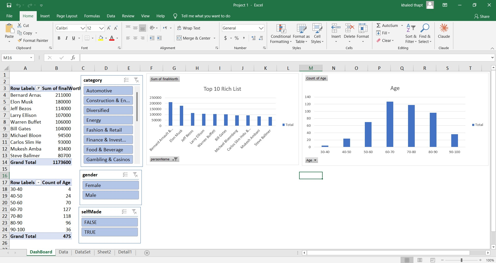

# 📊 Top 10 Richest People in the World — Excel Analysis

## 📌 Project Overview
An Excel-based data analysis project exploring the world's 
Top 10 wealthiest individuals, uncovering patterns across 
industries, net worth distribution, and gender representation.

## 🎯 Business Questions Answered
- Which industries dominate the Top 10 wealthiest list?
- What is the gender distribution among the world's richest?
- How is net worth distributed across different sectors?

## 🛠️ Tools Used
| Tool | Purpose |
|---|---|
| Microsoft Excel | Data Analysis & Dashboard |
| Pivot Tables | Data Aggregation |
| Charts & Graphs | Data Visualization |

## 💡 Key Insights
- **Bernard Arnault** leads with the highest net worth at **$211K**
- **Elon Musk** ranks 2nd at **$180K** net worth
- **8 industries** represented across the Top 10 list
- Industry breakdown: Automotive, Finance, Fashion, Energy & more
- Gender distribution analysis: **Female vs Male** representation
- Self-made vs inherited wealth: **TRUE vs FALSE** breakdown
- Age distribution analyzed across **7 age groups** (30–100)

## 📁 Files
| File | Description |
|---|---|
| `Project 1.xlsx` | Main Excel workbook with data & dashboard |

## 🔗 Connect with Me

## 📷 Dashboard Preview

